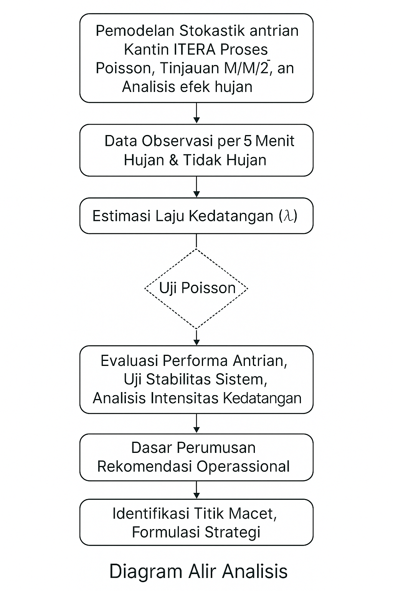

# 📊 Model Stokastik Antrian Kantin ITERA

### **Proses Poisson & M/M/1 pada Variasi Cuaca**

Repository ini berisi analisis lengkap menggunakan **Proses Poisson** dan **Model Antrian M/M/1** untuk memodelkan perilaku kedatangan dan layanan pelanggan di **Kantin Rumah Kayu ITERA**. Data diperoleh dari observasi nyata per 5 menit, dengan membandingkan **kondisi hujan** dan **tidak hujan**.
Analisis ini menghasilkan estimasi laju kedatangan, variabilitas antar slot waktu, kestabilan sistem, hingga rekomendasi strategis untuk peningkatan layanan kantin.

---

## 🚀 Fitur Utama

### **📈 Estimasi Laju Kedatangan (λ) menggunakan Proses Poisson**

* Rata-rata pelanggan/jam (λ):

  * Tidak Hujan: **119 pelanggan/jam**
  * Hujan: **83 pelanggan/jam**
* Penurunan akibat hujan: **–30.25%**

### **🧪 Uji Variabilitas Slot Waktu**

* Menghitung **mean dan varians per slot** (12 slot × 5 menit)
* Rasio var/mean sebagai indikator:

  * Hujan: **3.35** → Overdispersion tinggi
  * Tidak hujan: **0.94** → Variabilitas rendah
* Artinya: **hujan membuat kedatangan lebih tidak stabil**

### **📊 Profil λ(t) per Slot**

Grafik menunjukkan slot mana yang “meledak” atau drop drastis.
Contoh hasil:

* Slot hujan paling padat: slot pertama (**15 pelanggan**)
* Slot tidak hujan paling padat: slot ke-4–7 (**10–12 pelanggan**)

*(gambar disimpan sebagai `gambar/lambda_per_slot.png`)*

### **🔧 Analisis Kestabilan Sistem M/M/1**

Asumsi μ (pelayanan kasir) = 30 pelanggan/jam → **sistem tidak stabil (ρ > 1)**
Output:

| Kondisi     | λ   | μ  | ρ   | Stabil?        |
| ----------- | --- | -- | --- | -------------- |
| Tidak hujan | 119 | 30 | > 1 | ❌ Tidak stabil |
| Hujan       | 83  | 30 | > 1 | ❌ Tidak stabil |

### **📉 Penentuan μ Minimum Agar Queue Stabil**

Agar **Wq ≤ 5 menit**, diperlukan:

* μ ≈ **130 pelanggan/jam**
* Ini ≈ **4–5 kasir** jika tiap kasir melayani 30 pelanggan/jam

Grafik Wq vs μ disertakan:
*(gambar: `gambar/kurva_wq_vs_mu.png`)*

---

## 🔄 Diagram Alir Analisis Pemodelan Stokastik

Alur analisis terdiri dari:

1. **Input data observasi 5 menit**
2. **Agregasi per hari & per slot**
3. **Estimasi λ (Poisson)**
4. **Analisis var/mean (stabilitas proses)**
5. **Menghitung λ(t) per slot**
6. **Evaluasi kestabilan M/M/1**
7. **Simulasi kapasitas kasir (μ)**
8. **Rekomendasi operasional**

*(gambar disimpan sebagai `gambar/diagram_alir.png`)*

---

## 📁 Struktur Repository

```
📦 antrian-kantin-itera/
│
├── data/
│   └── data_kantin_observasi.csv
│
├── R/
│   └── model_poisson_mm1.R
│
├── gambar/
│   ├── lambda_per_slot.png
│   ├── kurva_wq_vs_mu.png
│   └── diagram_alir.png
│
└── README.md
```

---

## 🔍 Ringkasan Hasil Utama

### **1. Ringkasan Total Pelanggan per Hari**

| Tanggal    | Kondisi     | Total |
| ---------- | ----------- | ----- |
| 2025-11-11 | Tidak hujan | 112   |
| 2025-11-12 | Tidak hujan | 115   |
| 2025-11-13 | Tidak hujan | 134   |
| 2025-11-18 | Hujan       | 83    |
| 2025-11-19 | Tidak hujan | 115   |

---
## 🔄 Diagram Alir Analisis

Berikut adalah diagram alir proses analisis pemodelan stokastik:



---
### **2. Estimasi λ per Kondisi**

| Kondisi     | λ_mean | λ_sd  |
| ----------- | ------ | ----- |
| Hujan       | 83     | NA    |
| Tidak hujan | 119    | 10.10 |

---

### **3. Variabilitas Slot (Poisson Goodness Insight)**

| Kondisi     | mean_slot | var_slot | var/mean |
| ----------- | --------- | -------- | -------- |
| Hujan       | 6.92      | 23.17    | **3.35** |
| Tidak hujan | 9.92      | 9.31     | **0.94** |

Interpretasi:

* **Hujan → sistem lebih acak, sulit diprediksi**
* **Tidak hujan → lebih konstan, sesuai asumsi Poisson**

---

### **4. Elasticity Dampak Hujan**

Perubahan kedatangan akibat hujan:
**–30.25%**

Makna:

* 1 jam hujan = kehilangan ±36 pelanggan
* Selama jam makan siang → dampak signifikan pada pendapatan

---

### **5. Analisis M/M/1**

λ terlalu besar → sistem tidak stabil → antrian mengular → waktu tunggu panjang
Ketika λ mendekati μ → Wq → ∞ (meledak)

Simulasi mencari μ minimum untuk target Wq ≤ 5 menit:
**μ ≈ 130 pelanggan/jam**

---

## 💡 Insight Operasional yang Sangat Penting untuk Kampus

### **1. Kapasitas Kasir Saat Ini Tidak Memadai**

μ = 30 pelanggan/jam
λ tidak hujan = 119 → **ρ = 3.97** → mustahil stabil
Kantin pasti macet di jam makan siang.

### **2. Solusi Kapasitas Optimal**

Agar **Wq ≤ 5 menit**, diperlukan:

* ✔ 4–5 kasir
* atau ✔ 2 kasir + sistem order online/pickup

### **3. Pengaruh Hujan Terhadap Demand**

Penurunan 30% berarti:

* Kantin bisa merencanakan **jadwal pegawai adaptif cuaca**
* Mengembangkan **kanopi/lorong anti hujan** → mengurangi drop pelanggan

### **4. Slot Overload Dapat Diintervensi**

Dari grafik λ(t):

* Slot **1 dan 7** paling sibuk
  → bisa diarahkan ke **jalur cepat (fast lane)**

---

## 🧮 Teknologi yang Digunakan

* **R**
* **tidyverse**
* **ggplot2**
* **zoo**
* **dplyr**

---


## ✨ Tentang Proyek Ini

Analisis ini disusun sebagai **Tugas Besar Pemodelan Stokastik**, bertujuan memberikan dasar ilmiah bagi optimalisasi antrian kantin ITERA melalui Proses Poisson dan model antrian M/M/1. Hasilnya diharapkan menjadi referensi bagi pengembangan layanan makan siang berbasis data dan kebijakan peningkatan fasilitas kampus.

